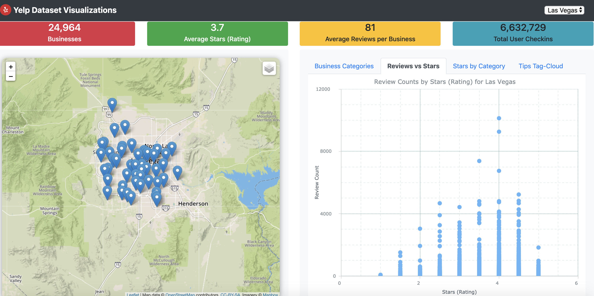

# Data Science Project: Visualizing Yelp's Dataset

## Rationale  

Explore and communicate insights from Yelp's businesses and tips dataset for Las Vegas, via an interactive web visualizations dashboard. 

## Dataset
* [Yelp's Open Dataset](https://www.yelp.com/dataset)
* [Documentation](https://www.yelp.com/dataset/documentation/main)
  * `business.json`: Contains business data including location data, attributes, and categories.
  * `tips.json`: Tips written by a user on a business. Tips are shorter than reviews and tend to convey quick suggestions.
  * `checkin.json`: Checkins on a business.

## Tools/Technologies Used
* Python-Flask powered RESTFUL API
* MongoDB
* HTML, CSS, JS, Bootstrap
* [D3.js](https://d3js.org/)
* [AnyChart.js](https://www.anychart.com/)
* [Plotly.js](https://plotly.com/javascript/)
* Python/Pandas and Excel to call the data, understand it, cleanse/manipulate it and create task specific JSONs

## Instructions to Run the Web App & Server

1. Download the original Yelp JSON Dataset files from [here](https://www.yelp.com/dataset/download). For this application you will only need the three data files below.
   - `yelp_academic_dataset_business.json`
   - `yelp_academic_dataset_checkin.json`
   - `yelp_academic_dataset_tip.json`
   
2. Download/Clone this repo to your local machine.

3. On your local machine, move the three Yelp JSON files above to the `static/assets/data` folder within your repo. Unzip the file `yelp_las_vegas_checkin_business_dataset_records.json.zip` located in the same folder.

4. Run all the cells in the Jupyter Notebook `yelp_dataset_cleanup.json` (for EDA purposes and to extract/convert data that we want to plot and analyze).

5. Make sure you have [MongoDB](https://www.mongodb.com/) installed on your machine, preferably with the [MongoDB Compass GUI](https://www.mongodb.com/products/compass).

6. Run `python load_yelp_dataset.py`. This will load the relevant Yelp JSON datasets to MongoDB. The script automatically creates the necessary collections and inserts the JSON documents to each collection.
   - *_Note:_* You may need to _"pip install"_ the packages: `json`, `os` and `pymongo`.

7. Start the Flask server by running `python yelp_app.py`.
   - *_Note:_* You may need to _"pip install"_ the packages - `bson`, `flask`, `flask_pymongo` and `flask_Cors`.
   ```
   * Serving Flask app "yelp_app" (lazy loading)
   * Environment: production
     WARNING: This is a development server. Do not use it in a production deployment.
     Use a production WSGI server instead.
   * Debug mode: on
   * Running on http://127.0.0.1:5000/ (Press CTRL+C to quit)
   * Restarting with stat
   * Debugger is active!
   * Debugger PIN: 257-766-732
   ```
8. Launch the app in the browser by going to: http://localhost:5500/yelp-visualizations/templates/index.html.
   You should see an interactive Yelp Dashboard for Las Vegas as shown below, with options to select various charts.

   
